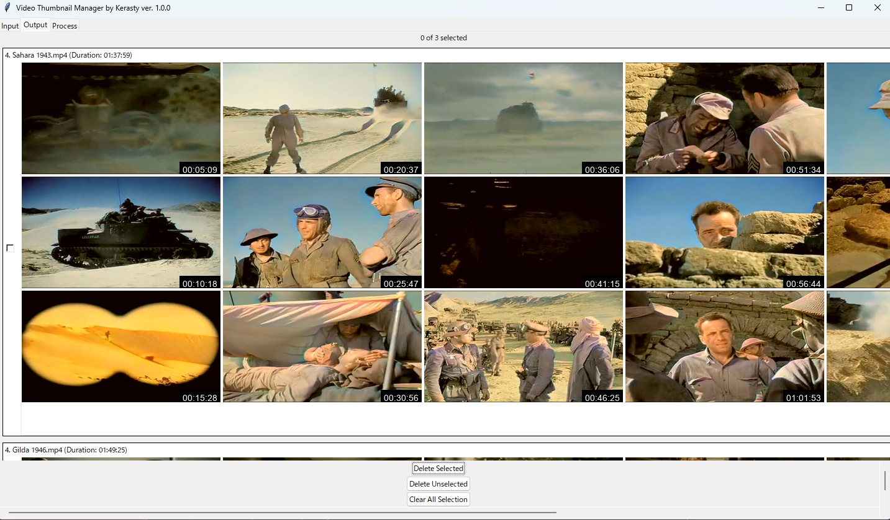

# Video Thumbnail Manager

**Language / 言語 / 语言**:  
🇬🇧 [English](#video-thumbnail-manager) | 🇯🇵 [日本語](#ビデオサムネイルマネージャー) | 🇨🇳 [简体中文](#视频缩略图管理器)

---

<!-- English section -->
## Video Thumbnail Manager


A Python application using FFmpeg and a Tkinter-based graphical user interface (GUI) for managing videos and thumbnails. This tool is designed to efficiently process video files, generate thumbnails, and provide a user-friendly interface for managing video collections.

## Features
- **Thumbnail Generation**: Generate thumbnails for any video format supported by FFmpeg, with robust support for H.264 videos and nv12 pixel formats.
- **GPU Acceleration**: Utilize CUDA hardware acceleration for faster thumbnail generation, with optimized fallback to CPU processing for compatibility with problematic videos.
- **Caching**: Cache thumbnails to improve performance and avoid redundant processing.
- **Interactive GUI**: Display thumbnails with zoom functionality, select videos, and delete selected or unselected files.
- **Progress Tracking**: Real-time progress bar and estimated time of arrival (ETA) display during thumbnail generation.
- **Configurable Settings**: Customize thumbnail count, width, quality, concurrent processing, and thumbnail distribution (uniform, triangular, normal).
- **Error Handling**: Detailed logging and fallback mechanisms (CUDA to CPU to placeholder thumbnails) ensure robust operation.
- **Process Monitoring**: View FFmpeg commands and thumbnail previews in the "Process" tab for debugging and transparency.

## Requirements
- **Python**: 3.8 or higher
- **FFmpeg**: Install via your package manager (e.g., apt install ffmpeg, brew install ffmpeg) or download from [FFmpeg.org](https://ffmpeg.org/) and add to PATH. Ensure CUDA support is enabled for GPU acceleration (requires NVIDIA GPU and drivers).
- **Python Packages**: Install dependencies listed in requirements.txt:
  - Pillow==10.2.0
  - loguru==0.7.2
  - numpy (for timestamp distribution)
  - tkinter (included with Python standard library)
- **Hardware (for CUDA)**: NVIDIA GPU with CUDA support and compatible drivers (optional but recommended for performance).

## Installation
Windows users can download the executable directly from the Release page. The following steps are for running from source:
1. **Clone the Repository**:
   
```bash
   git clone https://github.com/kerasty2024/video_thumbnail_manager.git
   cd video_thumbnail_manager
```

2. **Install Python Dependencies**:
   
```bash
   pip install -r requirements.txt
```

3. **Install FFmpeg**:
   - On Windows: Download from [gyan.dev](https://www.gyan.dev/ffmpeg/builds/) and add to PATH.
   - On macOS: brew install ffmpeg
   - On Linux: sudo apt install ffmpeg (Ubuntu/Debian) or equivalent.
   - Verify installation: ffmpeg -version
4. **Verify CUDA Support** (optional):
   - Run ffmpeg -hwaccels and ensure cuda is listed.
   - Ensure NVIDIA drivers are installed and up-to-date.

## Usage
1. **Run the Application**:
   
```bash
   python main.py
```

2. **Select Input Folder**:
   - In the "Input" tab, choose a folder containing video files.
   - Adjust settings such as thumbnail quality, width, number of thumbnails per video, and concurrent processing.
3. **Generate Thumbnails**:
   - Click "Start" to begin processing. The application prioritizes CUDA acceleration for thumbnail generation.
4. **Manage Thumbnails**:
   - View thumbnails in the "Output" tab, zoom in/out, and select videos for deletion.
5. **Monitor Progress**:
   - The "Process" tab displays FFmpeg commands, progress updates, and thumbnail previews.
   - A progress bar and ETA are shown in the "Input" tab during processing.

## Configuration
The application uses a config.json file in the project root to store settings. If not present, it will be created with default values. Example structure:

```json
{
    "cache_dir": "",
    "default_folder": "",
    "thumbnails_per_video": 5,
    "thumbnail_width": 320,
    "thumbnail_quality": 4,
    "concurrent_videos": 4,
    "zoom_factor": 2.0,
    "min_size_mb": 0,
    "min_duration_seconds": 0,
    "use_peak_concentration": false,
    "thumbnail_peak_pos": 0.5,
    "thumbnail_concentration": 0.2,
    "thumbnail_distribution": "NORMAL"
}
```

- **cache_dir**: Directory for thumbnail cache (leave empty for default: <video_folder>/cache).
- **default_folder**: Default folder for video files (leave empty to prompt user).
- **thumbnails_per_video**: Number of thumbnails to generate per video (default: 18).
- **thumbnail_width**: Thumbnail width in pixels (default: 320).
- **thumbnail_quality**: MJPEG quality (1–31, lower is better; default: 4, higher quality for smaller values).
- **concurrent_videos**: Number of videos processed simultaneously (default: 4).
- **zoom_factor**: Zoom multiplier for thumbnail display when using Ctrl+mouse hover (default: 2.0).
- **min_size_mb**: Minimum video file size in MB to process (default: 0, no limit).
- **min_duration_seconds**: Minimum video duration in seconds to process (default: 0, no limit).
- **use_peak_concentration**: Enable non-uniform thumbnail distribution (default: false).
- **thumbnail_peak_pos**: Peak position for non-uniform distribution (0.0–1.0, default: 0.7).
- **thumbnail_concentration**: Concentration for normal distribution (default: 0.2).
- **thumbnail_distribution**: Distribution type (UNIFORM, TRIANGULAR, NORMAL; default: NORMAL).

Settings can also be adjusted via the GUI and saved to config.json automatically.

## Thumbnail Generation Process
The application uses FFmpeg to generate thumbnails with a robust fallback mechanism to handle various video formats, including those with nv12 pixel formats:

1. **CUDA Attempt 1**: Uses -hwaccel cuda with -vf format=yuv420p,scale=... for GPU-accelerated decoding and scaling.
2. **CUDA Attempt 2**: Uses -hwaccel cuda, -hwaccel_output_format cuda, -c:v h264_cuvid with a filter chain (scale_cuda=...,hwdownload,format=nv12,format=yuv420p,colorspace=...) for optimized CUDA processing and color space handling.
3. **CUDA Attempt 3**: Uses -hwaccel cuda with -vf scale_cuda=... and -pix_fmt yuv420p for alternative GPU scaling.
4. **CPU Fallback**: If CUDA fails, uses a CPU-based command with -vf colorspace=all=bt709:iall=bt709,scale=...,format=yuv420p to ensure compatibility with problematic videos (e.g., H.264 with nv12).
5. **Placeholder Fallback**: If all attempts fail, generates a gray placeholder thumbnail.

Logs in debug.log provide detailed information on each attempt, including FFmpeg commands and errors.

## Screenshots


## Troubleshooting
- **FFmpeg Not Found**:
  - Ensure FFmpeg is installed and added to your system PATH.
  - Verify with ffmpeg -version in a terminal.
- **Thumbnails Not Generated**:
  - Check debug.log for FFmpeg errors (e.g., pixel format issues, CUDA errors).
  - Ensure CUDA drivers are installed if using GPU acceleration.
  - Verify video files are accessible and not corrupted.
- **CUDA Errors (e.g., nv12 issues)**:
  - The application automatically falls back to CPU processing for videos with incompatible pixel formats.
  - Ensure your NVIDIA drivers and FFmpeg build support CUDA (ffmpeg -hwaccels).
- **Slow Processing**:
  - Reduce concurrent_videos in config.json or the GUI to lower system load.
  - Ensure CUDA is enabled for faster processing if you have an NVIDIA GPU.
- **GUI Issues**:
  - Ensure Pillow and tkinter are installed correctly.
  - Check console output for Python errors.

For persistent issues, open a GitHub issue with details from debug.log and your system configuration.

## Contributing
Contributions are welcome! To contribute:
1. Fork the repository.
2. Create a feature branch (git checkout -b feature/your-feature).
3. Commit changes (git commit -m "Add your feature").
4. Push to the branch (git push origin feature/your-feature).
5. Open a pull request.

Please include tests and update documentation where relevant.

## Support via Sponsorship Platforms
- **GitHub Sponsors**: [https://github.com/kerasty2024](https://github.com/kerasty2024)
- **Buy Me a Coffee**: [https://buymeacoffee.com/kerasty](https://buymeacoffee.com/kerasty)

## Support with Cryptocurrency
Support the project by sending cryptocurrency to the following addresses. Every contribution helps fund development, server costs, and future enhancements!

| Cryptocurrency | Address                                                   | QR Code                                          |
|----------------|-----------------------------------------------------------|--------------------------------------------------|
| Bitcoin (BTC)  | bc1qn72yvftnuh7jgjnn9x848pzhhywasxmqt5c7wp |        |
| Ethereum (ETH) | 0x2175Ed9c75C14F113ab9cEaDc1890b2f87f40e78 |        |
| Solana (SOL)   | 6Hc7erZqgreTVwCsTtNvsyzigN2oHJ4EgNGaLWtRWJ69 |  |

**How to Contribute with Crypto**:
1. Copy the address or scan the QR code using your wallet app.
2. Send any amount to support the project.
3. Your contribution helps keep this project alive—thank you!

## License
See [LICENSE](LICENSE) for details.

---

<!-- Japanese section -->
## ビデオサムネイルマネージャー


FFmpeg と Tkinter ベースのグラフィカルユーザーインターフェース（GUI）を使用した Python アプリケーション。
ビデオとサムネイルの管理を行います。このツールは、ビデオファイルのサムネイル素早く生成し、ビデオコレクションを管理するためのユーザーフレンドリーなインターフェースを提供することを目的としています。

## 機能
- **サムネイル生成**：FFmpeg がサポートするすべてのビデオ形式に対してサムネイルを生成し、特に H.264 ビデオと nv12 ピクセル形式に対して強力なサポートを提供します。
- **GPU アクセラレーション**：CUDA ハードウェアアクセラレーションを利用してサムネイル生成を高速化し、問題のあるビデオに対しては最適化された CPU 処理へのフォールバックを行います。
- **キャッシュ**：サムネイルをキャッシュしてパフォーマンスを向上させ、冗長な処理を回避します。
- **インタラクティブ GUI**：サムネイルをズーム機能付きで表示し、ビデオを選択したり、選択済みまたは未選択のファイルを削除したりできます。
- **進捗追跡**：サムネイル生成中にリアルタイムでプログレスバーと推定完了時間（ETA）を表示します。
- **カスタマイズ可能な設定**：サムネイルの数、幅、品質、同時処理数、サムネイル分布（均等、三角、正規）をカスタマイズできます。
- **エラー処理**：詳細なログ記録とフォールバックメカニズムにより、堅牢な動作を保証します。
- **プロセス監視**：「プロセス」タブで FFmpeg コマンドとサムネイルプレビューを表示し、デバッグと透明性を確保します。

## 要件
- **Python**：3.8 以上
- **FFmpeg**：パッケージマネージャ（例：apt install ffmpeg、brew install ffmpeg）経由でインストールするか、[FFmpeg.org](https://ffmpeg.org/) からダウンロードして PATH に追加します。GPU アクセラレーションには CUDA サポートを有効にする必要があります（NVIDIA GPU とドライバが必要です）。
- **Python パッケージ**：requirements.txt に記載された依存関係をインストール：
  - Pillow==10.2.0
  - loguru==0.7.2
  - numpy（タイムスタンプ分布用）
  - tkinter（Python 標準ライブラリに含まれる）
- **ハードウェア（CUDA 用）**：CUDA をサポートする NVIDIA GPU と互換性のあるドライバ（オプションですが、パフォーマンス向上のために推奨）。

## インストール
Windows ユーザーはリリースページから直接実行ファイルをダウンロードできます。以下の手順はソースコードからの実行方法です：
1. **リポジトリをクローン**：
   
```bash
   git clone https://github.com/kerasty2024/video_thumbnail_manager.git
   cd video_thumbnail_manager
```

2. **Python 依存関係をインストール**：
   
```bash
   pip install -r requirements.txt
```

3. **FFmpeg をインストール**：
   - Windows： [gyan.dev](https://www.gyan.dev/ffmpeg/builds/) からダウンロードして PATH に追加。
   - macOS：brew install ffmpeg
   - Linux：sudo apt install ffmpeg（Ubuntu/Debian）または同等のコマンド。
   - インストールを確認：ffmpeg -version
4. **CUDA サポートの確認**（オプション）：
   - ffmpeg -hwaccels を実行し、cuda がリストに含まれていることを確認。
   - NVIDIA ドライバがインストールされ、最新であることを確認。

## 使用方法
1. **アプリケーションを実行**：
   
```bash
   python main.py
```

2. **入力フォルダを選択**：
   - 「入力」(Input)タブで、ビデオファイルを含むフォルダを選択。
   - サムネイルの品質、幅、ビデオごとのサムネイル数、同時処理数などの設定を調整。
3. **サムネイルを生成**：
   - 「開始」(Start)をクリックして処理を開始。アプリケーションはサムネイル生成に CUDA アクセラレーションを優先的に使用。
4. **サムネイルを管理**：
   - 「出力」(Output)タブでサムネイルを表示、ズームイン/アウト、削除するビデオを選択。
5. **進捗を監視**：
   - 「プロセス」(Process)タブで FFmpeg コマンド、進捗更新、サムネイルプレビューを表示。
   - 「入力」(Input)タブにプログレスバー ETA を表示。

## 設定
アプリケーションはプロジェクトルートにある config.json ファイルを使用して設定を保存します。存在しない場合は、デフォルト値で作成されます。config.jsonの一例：：

```json
{
    "cache_dir": "",
    "default_folder": "",
    "thumbnails_per_video": 18,
    "thumbnail_width": 320,
    "thumbnail_quality": 4,
    "concurrent_videos": 4,
    "zoom_factor": 2.0,
    "min_size_mb": 0,
    "min_duration_seconds": 0,
    "use_peak_concentration": false,
    "thumbnail_peak_pos": 0.5,
    "thumbnail_concentration": 0.2,
    "thumbnail_distribution": "NORMAL"
}
```

- **cache_dir**：サムネイルキャッシュのディレクトリ（空の場合、デフォルト：<video_folder>/cache）。
- **default_folder**：ビデオファイルのデフォルトフォルダ（空の場合、ユーザーに選択を促す）。
- **thumbnails_per_video**：ビデオごとに生成するサムネイルの数（デフォルト：18）。
- **thumbnail_width**：サムネイルの幅（ピクセル、デフォルト：320）。
- **thumbnail_quality**：MJPEG 品質（1–31、値が小さいほど高品質；デフォルト：4、値が小さいほど高品質）。
- **concurrent_videos**：同時に処理するビデオの数（デフォルト：4）。
- **zoom_factor**：Ctrl+マウスホバー時のサムネイル表示のズーム倍率（デフォルト：2.0）。
- **min_size_mb**：処理する最小ビデオファイルサイズ（MB、デフォルト：0、制限なし）。
- **min_duration_seconds**：処理する最小ビデオ再生時間（秒、デフォルト：0、制限なし）。
- **use_peak_concentration**：非均等サムネイル分布を有効化（デフォルト：false）。
- **thumbnail_peak_pos**：非均等分布のピーク位置（0.0–1.0、デフォルト：0.7）。
- **thumbnail_concentration**：正規分布の集中度（デフォルト：0.2）。
- **thumbnail_distribution**：分布タイプ（UNIFORM、TRIANGULAR、NORMAL；デフォルト：NORMAL）。

設定は GUI 経由で調整でき、自動的に config.json に保存されます。

## サムネイル生成プロセス
アプリケーションは FFmpeg を使用してサムネイルを生成し、nv12 ピクセル形式を含むさまざまなビデオ形式を処理するための堅牢なフォールバックメカニズムを備えています：

1. **CUDA 試行 1**：-hwaccel cuda と -vf format=yuv420p,scale=... を使用して、GPU アクセラレーションによるデコードとスケーリングを実行。
2. **CUDA 試行 2**：-hwaccel cuda、-hwaccel_output_format cuda、-c:v h264_cuvid とフィルタチェーン（scale_cuda=...,hwdownload,format=nv12,format=yuv420p,colorspace=...）を使用して、最適化された CUDA 処理とカラー空間処理を実行。
3. **CUDA 試行 3**：-hwaccel cuda と -vf scale_cuda=... および -pix_fmt yuv420p を使用して、代替の GPU スケーリングを実行。
4. **CPU フォールバック**：CUDA が失敗した場合、-vf colorspace=all=bt709:iall=bt709,scale=...,format=yuv420p を使用した CPU ベースのコマンドで、問題のあるビデオ（例：nv12 の H.264）との互換性を確保。
5. **プレースホルダーフォールバック**：すべての試行が失敗した場合、灰色のプレースホルダーサムネイルを生成。

debug.log のログには、FFmpeg コマンドやエラーなど、各試行の詳細情報が記載されています。

## スクリーンショット


## トラブルシューティング
- **FFmpeg が見つからない**：
  - FFmpeg がインストールされ、システム PATH に追加されていることを確認。
  - ターミナルで ffmpeg -version を実行して確認。
- **サムネイルが生成されない**：
  - debug.log で FFmpeg エラー（例：ピクセル形式の問題、CUDA エラー）を確認。
  - GPU アクセラレーションを使用する場合、CUDA ドライバがインストールされていることを確認。
  - ビデオファイルがアクセス可能で破損していないことを確認。
- **CUDA エラー（例：nv12 の問題）**：
  - アプリケーションは、互換性のないピクセル形式のビデオに対して自動的に CPU 処理にフォールバック。
  - NVIDIA ドライバと FFmpeg ビルドが CUDA をサポートしていることを確認（ffmpeg -hwaccels）。
- **処理が遅い**：
  - config.json または GUI で concurrent_videos を減らしてシステム負荷を軽減。
  - NVIDIA GPU がある場合、CUDA を有効にして処理を高速化。
- **GUI の問題**：
  - Pillow と tkinter が正しくインストールされていることを確認。
  - コンソール出力で Python エラーを確認。

持続的な問題については、debug.log とシステム構成の詳細を添えて、GitHub でイシューを開いてください。

## 貢献
貢献を歓迎します！貢献手順：
1. リポジトリをフォーク。
2. 機能ブランチを作成（git checkout -b feature/your-feature）。
3. 変更をコミット（git commit -m "Add your feature"）。
4. ブランチをプッシュ（git push origin feature/your-feature）。
5. プルリクエストを提出。

テストを含め、関連するドキュメントを更新してください。

## スポンサープラットフォームによるサポート
- **GitHub Sponsors**：[https://github.com/kerasty2024](https://github.com/kerasty2024)
- **Buy Me a Coffee**：[https://buymeacoffee.com/kerasty](https://buymeacoffee.com/kerasty)

## 暗号通貨によるサポート
以下のアドレスに暗号通貨を送ることでプロジェクトをサポートできます。すべての寄付は、開発、サーバーコスト、将来の機能強化に役立ちます！

| 暗号通貨       | アドレス                                                   | QR コード                                          |
|----------------|-----------------------------------------------------------|--------------------------------------------------|
| ビットコイン (BTC)  | bc1qn72yvftnuh7jgjnn9x848pzhhywasxmqt5c7wp |        |
| イーサリアム (ETH) | 0x2175Ed9c75C14F113ab9cEaDc1890b2f87f40e78 |        |
| ソラナ (SOL)   | 6Hc7erZqgreTVwCsTtNvsyzigN2oHJ4EgNGaLWtRWJ69 |  |

**暗号通貨で貢献する方法**：
1. アドレスをコピーするか、ウォレットアプリで QR コードをスキャン。
2. プロジェクトをサポートするために任意の金額を送金。
3. あなたの貢献がこのプロジェクトを継続させる力になります—ありがとう！

## ライセンス
詳細は [LICENSE](LICENSE) を参照。

---

<!-- Chinese section -->
## 视频缩略图管理器(Video Thumbnail Manager)


一款使用 FFmpeg 和基于 Tkinter 的图形用户界面（GUI） Python 应用程序，用于管理视频以及封面图。该工具旨在高效处理视频文件，生成缩略图，并提供用户友好的界面来管理视频集合。

## 功能
- **缩略图生成**：为 FFmpeg 支持的任何视频格式生成缩略图，特别针对 H.264 视频和 nv12 像素格式提供强大支持。
- **GPU 加速**：利用 CUDA 硬件加速实现更快的缩略图生成，并为兼容性问题视频优化回退到 CPU 处理。
- **缓存**：缓存缩略图以提高性能并避免重复处理。
- **交互式 GUI**：显示缩略图并支持缩放功能，选择视频，并删除选中或未选中的文件。
- **进度跟踪**：缩略图生成期间实时显示进度条和预计完成时间（ETA）。
- **可配置设置**：自定义缩略图数量、宽度、质量、并发处理数，以及生成封面图采用的分布方式（支持均匀分布、三角分布、正态分布）。
- **错误处理**：详细的日志记录和回退机制（从 CUDA 到 CPU 再到占位缩略图）确保稳健运行。
- **进程监控**：在“进程”(Process)选项卡中查看 FFmpeg 命令和缩略图预览，便于调试和透明化。

## 要求
- **Python**：3.8 或更高版本
- **FFmpeg**：通过包管理器安装（例如，apt install ffmpeg、brew install ffmpeg）或从 [FFmpeg.org](https://ffmpeg.org/) 下载并加入PATH。确保启用 CUDA 支持以实现 GPU 加速（需要 NVIDIA GPU 和驱动程序）。
- **Python 包**：安装 requirements.txt 中列出的依赖项：
  - Pillow==10.2.0
  - loguru==0.7.2
  - numpy（用于时间戳分布）
  - tkinter（Python 标准库中包含）
- **硬件（用于 CUDA）**：支持 CUDA 的 NVIDIA GPU 和兼容的驱动程序（可选，但推荐以提升性能）。

## 安装
Windows用户可直接从Release页面下载可执行程序。以下为源文件运行方式：
1. **克隆仓库**：
   
```bash
   git clone https://github.com/kerasty2024/video_thumbnail_manager.git
   cd video_thumbnail_manager
```

2. **安装 Python 依赖项**：
   
```bash
   pip install -r requirements.txt
```

3. **安装 FFmpeg**：
   - Windows：从 [gyan.dev](https://www.gyan.dev/ffmpeg/builds/) 下载并添加到 PATH。
   - macOS：brew install ffmpeg
   - Linux：sudo apt install ffmpeg（Ubuntu/Debian）或等效命令。
   - 验证安装：ffmpeg -version
4. **验证 CUDA 支持**（可选）：
   - 运行 ffmpeg -hwaccels，确保列出 cuda。
   - 确保已安装并更新 NVIDIA 驱动程序。

## 使用方法
1. **运行应用程序**：
   
```bash
   python main.py
```

2. **选择输入文件夹**：
   - 在“输入”(Input)选项卡中，选择包含视频文件的文件夹。
   - 调整设置，例如缩略图质量、宽度、每个视频的缩略图数量和并发处理数。
3. **生成缩略图**：
   - 点击“开始”（Start）以启动处理。应用程序优先使用 CUDA 加速生成缩略图。
4. **管理缩略图**：
   - 在“输出”(Output)选项卡中查看缩略图，支持放大/缩小，并选择视频进行删除。
5. **监控进度**：
   - “进程”(Process)选项卡显示 FFmpeg 命令、进度更新和缩略图预览。
   - 处理期间，“输入”选项卡中显示进度条和预计完成时间。

## 配置
应用程序使用项目根目录中的 config.json 文件存储设置。如果不存在，将以默认值创建。示例结构：

```json
{
    "cache_dir": "",
    "default_folder": "",
    "thumbnails_per_video": 5,
    "thumbnail_width": 320,
    "thumbnail_quality": 4,
    "concurrent_videos": 4,
    "zoom_factor": 2.0,
    "min_size_mb": 0,
    "min_duration_seconds": 0,
    "use_peak_concentration": false,
    "thumbnail_peak_pos": 0.5,
    "thumbnail_concentration": 0.2,
    "thumbnail_distribution": "UNIFORM"
}
```

- **cache_dir**：缩略图缓存目录（留空为默认：<video_folder>/cache）。
- **default_folder**：视频文件的默认文件夹（留空以提示用户）。
- **thumbnails_per_video**：每个视频生成的缩略图数量（默认：18）。
- **thumbnail_width**：缩略图宽度（像素，默认：320）。
- **thumbnail_quality**：MJPEG 质量（1–31，数值越低质量越好；默认：4，越小质量越高）。
- **concurrent_videos**：同时处理的视频数量（默认：4）。
- **zoom_factor**：Ctrl+鼠标置放时缩略图的缩放倍数（默认：2.0）。
- **min_size_mb**：处理的最小视频文件大小（MB，默认：0，无限制）。
- **min_duration_seconds**：处理的最小视频时长（秒，默认：0，无限制）。
- **use_peak_concentration**：启用非均匀缩略图分布（默认：false）。
- **thumbnail_peak_pos**：非均匀分布的峰值位置（0.0–1.0，默认：0.7）。
- **thumbnail_concentration**：正态分布的集中度（默认：0.2）。
- **thumbnail_distribution**：分布类型（UNIFORM、TRIANGULAR、NORMAL；默认：UNIFORM）。

设置也可以通过 GUI 调整，并自动保存到 config.json。

## 缩略图生成过程
应用程序使用 FFmpeg 生成缩略图，并采用稳健的回退机制处理各种视频格式，包括 nv12 像素格式的视频：

1. **CUDA 尝试 1**：使用 -hwaccel cuda 和 -vf format=yuv420p,scale=... 进行 GPU 加速解码和缩放。
2. **CUDA 尝试 2**：使用 -hwaccel cuda、-hwaccel_output_format cuda、-c:v h264_cuvid 以及滤镜链（scale_cuda=...,hwdownload,format=nv12,format=yuv420p,colorspace=...）进行优化的 CUDA 处理和色彩空间处理。
3. **CUDA 尝试 3**：使用 -hwaccel cuda 和 -vf scale_cuda=... 以及 -pix_fmt yuv420p 进行替代的 GPU 缩放。
4. **CPU 回退**：如果 CUDA 失败，则使用基于 CPU 的命令 -vf colorspace=all=bt709:iall=bt709,scale=...,format=yuv420p，确保兼容问题视频（例如，带 nv12 的 H.264）。
5. **占位回退**：如果所有尝试失败，则生成灰色占位缩略图。

debug.log 中的日志提供每次尝试的详细信息，包括 FFmpeg 命令和错误。

## 截图


## 故障排除
- **未找到 FFmpeg**：
  - 确保 FFmpeg 已安装并添加到系统 PATH。
  - 在终端中验证：ffmpeg -version。
- **未生成缩略图**：
  - 检查 debug.log 中的 FFmpeg 错误（例如，像素格式问题、CUDA 错误）。
  - 如果使用 GPU 加速，确保已安装 CUDA 驱动程序。
  - 验证视频文件可访问且未损坏。
- **CUDA 错误（例如，nv12 问题）**：
  - 应用程序会自动回退到 CPU 处理不兼容像素格式的视频。
  - 确保 NVIDIA 驱动程序和 FFmpeg 构建支持 CUDA（ffmpeg -hwaccels）。
- **处理速度慢**：
  - 在 config.json 或 GUI 中减少 concurrent_videos 以降低系统负载。
  - 如果有 NVIDIA GPU，确保启用 CUDA 以加快处理速度。
- **GUI 问题**：
  - 确保正确安装 Pillow 和 tkinter。
  - 检查控制台输出的 Python 错误。

对于持续存在的问题，请在 GitHub 上提交问题，并提供 debug.log 和系统配置的详细信息。

## 贡献
欢迎贡献！贡献步骤：
1. Fork 仓库。
2. 创建功能分支（git checkout -b feature/your-feature）。
3. 提交更改（git commit -m "Add your feature"）。
4. 推送分支（git push origin feature/your-feature）。
5. 提交拉取请求。

请包含测试并更新相关文档。

## 通过赞助平台支持
- **GitHub Sponsors**：[https://github.com/kerasty2024](https://github.com/kerasty2024)
- **Buy Me a Coffee**：[https://buymeacoffee.com/kerasty](https://buymeacoffee.com/kerasty)

## 使用加密货币支持
通过以下地址发送加密货币支持项目。每一份贡献都有助于资助开发、服务器成本和未来改进！

| 加密货币       | 地址                                                       | 二维码                                            |
|----------------|-----------------------------------------------------------|------------------------------------------------|
| 比特币 (BTC)   | bc1qn72yvftnuh7jgjnn9x848pzhhywasxmqt5c7wp |          |
| 以太坊 (ETH)   | 0x2175Ed9c75C14F113ab9cEaDc1890b2f87f40e78 |          |
| 索拉纳 (SOL)   | 6Hc7erZqgreTVwCsTtNvsyzigN2oHJ4EgNGaLWtRWJ69 |    |

**如何通过加密货币贡献**：
1. 复制地址或使用钱包应用程序扫描二维码。
2. 发送任意金额以支持项目。
3. 您的贡献有助于保持项目的活力——感谢您！

## 许可证
详情见 [LICENSE](LICENSE)。